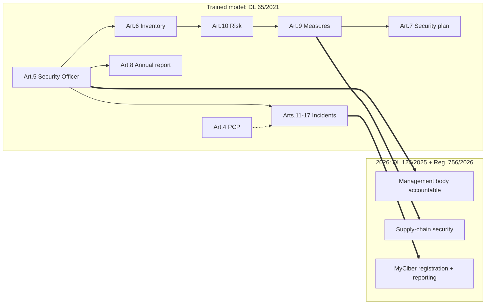

# Responsável de Cibersegurança — Portugal

Personal operating notes from the CNCS training **Responsável de Cibersegurança** (May 2025), plus a 2026 map onto the law that is actually in force now.

How I hold the role in my head: the legal duties of a Security Officer under Portuguese cyberspace law, the GRC frameworks that implement them, and the documents I would actually sign.

> **Law as of 2026:** NIS2 is transposed by **Decreto-Lei 125/2025** (Regime Jurídico da Cibersegurança), in force **3 April 2026**, with **Regulamento 756/2026** (CNCS / MyCiber). I trained on the previous stack (**Lei 46/2018 + DL 65/2021**). The job shape is the same, PCP, Security Officer, inventory, risk, plan, incidents, annual report, under a wider essential / important / relevant-public scope. Details in [module 1](modules/01-legislacao/README.md).

---

**Start here (5 minutes):** [Legislation](modules/01-legislacao/README.md) → [Risk analysis](modules/03-analise-risco/README.md) → [Incident management](modules/08-gestao-incidentes/README.md) → [Compliance programme](modules/12-conformidade-rjsc/README.md).

---

## Capability map

The article column is the **DL 65/2021 anatomy I trained on**. The same duties carry into DL 125/2025 + Reg. 756/2026. When I write for an entity in 2026, I cite the new diploma.

| Area | Trained on (DL 65/2021) | See |
| --- | --- | --- |
| Stand up the **Ponto de Contacto Permanente** and the **Responsável de Segurança** | Arts. 4–5 | [Module 1](modules/01-legislacao/README.md) |
| Run **risk analysis** and treat risk (including with **MONARC**) | Art. 10, ISO 27005 | [3](modules/03-analise-risco/README.md), [4](modules/04-monarc/README.md) |
| Build an **asset inventory** that is defensible to CNCS | Art. 6 | [7](modules/07-inventario-ativos/README.md) |
| Write a **PSI** and a **Plano de Segurança** | Arts. 7, 9 | [9](modules/09-politica-seguranca/README.md), [10](modules/10-plano-seguranca/README.md) |
| Run **incident response** and **notify CNCS** | Arts. 11–17, Lei 46/2018 | [8](modules/08-gestao-incidentes/README.md) |
| Produce the **Relatório Anual de Cibersegurança** | Art. 8 | [11](modules/11-relatorio-anual/README.md) |
| Map controls to **QNRCS**, **ISO 27001**, **NIST CSF**, **CIS Controls**, **COBIT** | GRC | [2](modules/02-frameworks/README.md), [13](modules/13-certificacao-qnrcs/README.md) |
| Plan **RJC / NIS2** compliance and talk **maturity** | DL 125/2025, QNRCS, Selo Digital | [12](modules/12-conformidade-rjsc/README.md), [14](modules/14-selo-maturidade/README.md) |

---

## Keyword index

Search terms (PT / EU / frameworks / operations)

**Role:** Responsável de Segurança · CISO · Security Officer · GRC · cyber risk · compliance

**Portugal / CNCS:** RJC · **DL 125/2025** · Regulamento **756/2026** · MyCiber · RJSC (Lei 46/2018, regime anterior) · DL 65/2021 · Regulamento 183/2022 · CNCS · CSIRT Nacional · Ponto de Contacto Permanente · inventário de ativos · plano de segurança · relatório anual · notificação de incidentes · QNRCS · Quadro Nacional de Referência para a Cibersegurança · esquema de certificação QNRCS · Selo de Maturidade Digital

**EU:** NIS / SRI · **NIS2** (Diretiva 2022/2555) · entidades essenciais vs. importantes · DORA · CER / REC · **RGPD / GDPR** · Cybersecurity Act (Reg. 2019/881)

**Frameworks:** **ISO/IEC 27001** · 27002 · 27005 · SGSI / ISMS · **NIST CSF** (Identify, Protect, Detect, Respond, Recover, Govern) · **CIS Controls v8** · **COBIT 2019** · EGIT · **MONARC** · CIA / CID

**Operations:** asset inventory · CMDB · risk treatment · technical and organisational measures (TOMs) · PSI · acceptable use · IRP · BCP / DR · RTO / RPO · SIEM · EDR · vulnerability management · least privilege · MFA · Zero Trust · supply-chain risk · audit · SoA (statement of applicability)

---

## Duty map

---

## Modules

| # | Module | One-liner |
| --- | --- | --- |
| 1 | [Legislation](modules/01-legislacao/README.md) | NIS → RJSC → DL 65/2021 → NIS2 and the two named functions |
| 2 | [Frameworks](modules/02-frameworks/README.md) | CIS, COBIT, ISO 27001, NIST CSF, QNRCS — when I pick which |
| 3 | [Risk analysis](modules/03-analise-risco/README.md) | Threat / vuln / asset / control, plus a worked exercise |
| 4 | [MONARC](modules/04-monarc/README.md) | Tool I used to treat risk, not just describe it |
| 5 | [Technical & organisational measures](modules/05-medidas/README.md) | TOMs, defense in depth, CNPD + QNRCS |
| 6 | [Audit & monitoring](modules/06-auditoria/README.md) | What a cyber audit actually covers |
| 7 | [Asset inventory](modules/07-inventario-ativos/README.md) | Critical assets vs. the CNCS-facing list |
| 8 | [Incident management](modules/08-gestao-incidentes/README.md) | Lifecycle, CSIRT, notification clocks |
| 9 | [Information security policy](modules/09-politica-seguranca/README.md) | PSI as the parent document of the SGSI |
| 10 | [Security plan](modules/10-plano-seguranca/README.md) | Art. 7 plan: measures, owners, continuity |
| 11 | [Annual report](modules/11-relatorio-anual/README.md) | What the Security Officer signs and sends |
| 12 | [Compliance programme (RJC / NIS2)](modules/12-conformidade-rjsc/README.md) | How the pieces become a programme |
| 13 | [QNRCS certification](modules/13-certificacao-qnrcs/README.md) | Basic / Substantial / High, CNCS scheme |
| 14 | [Digital maturity seal](modules/14-selo-maturidade/README.md) | Public maturity signal vs. legal duty |

---

## How this was built

- **My notes** from the May 2025 training (legislation timeline, CIS Controls, risk exercise, inventory, annual report).
- **Structured recaps** of the same syllabus: public law, public CNCS scheme documents and standard GRC practice. Written so a hiring conversation can start from any module.
- **Not included on purpose:** course slides, LMS zips, ISO/CIS/COBIT PDFs, videos or anyone else's keys.

---

## Disclaimer

Unofficial personal notes. Not affiliated with CNCS. Not legal advice. Laws and schemes change. Read the source text (**DL 125/2025**, **Reg. 756/2026**, and for the trained model Lei 46/2018 / DL 65/2021) before you act.
